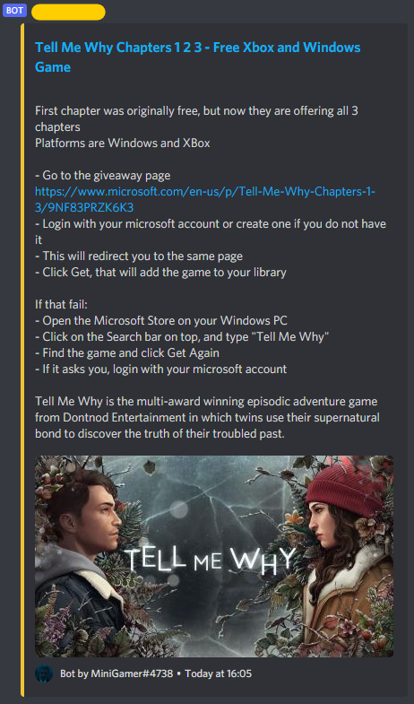

Goal
===============
To make a discord bot that helps me manage my own personal server  
This is not meant to be used on multiple servers hence the serverID and channel IDs are hard coded into .env

Usage
===============
The [guide](https://discordjs.guide/preparations/setting-up-a-bot-application.html#creating-your-bot)
I found useful  
Setup your bot application in the [Discord developer portal](https://discord.com/developers/applications)

## Setup environment variables
For environment variables I use [dotenv](https://github.com/motdotla/dotenv)

example [.env](./.env.example)
```ini
TOKEN = YOUR_TOKEN_KEY_HERE
ServerID = YOUR_SERVER_ID_HERE
YouTubeCookie = null

TestChanID = TESTING_CHANNEL_ID
GiveawaysID = CHANNEL_WHERE_GIVEAWAYS_WILL_BE_POSTED
```
Channel IDs will be used to find the channel associated with the ID:
- GiveawaysID - the channel where giveaways will be posted when the bot is run.  
This channel can be changed during runtime with a command (€giveaways).  
Currently the change won't be saved after program is closed

## To run
install node packages using `npm install`  
start the bot with `npm start`

For testing I use [Jest](https://jestjs.io/) testing framework  
Tests can be run with `npm test`

For linting I use [ESLint](https://eslint.org/)  
Linter can be run with `npm run lint`

About the bot itself
===============
## Commands
Command handler is pretty much the same as in the Discord.js [guide](https://discordjs.guide/command-handling/adding-features.html)

Currently available commands are:
- help [arg] - creates a MessageEmbed of all available commands 
if argument is used then information about the specified command is given
- giveaways - changes the channel where giveaways are posted and then posts the giveaways

## Giveaways
### Fetching Giveaways
HTTP requests are made using [axios](https://github.com/axios/axios)
#### Fetch Section
This bot mainly tries to get giveaways from https://grabfreegames.com/  
Should that fail it will then try to get them from
[GrabFreeGames steam group page](https://steamcommunity.com/groups/GrabFreeGames/announcements/listing)

#### Conversion
Fetched html will be turned into a usable format using [Cheerio](https://cheerio.js.org/) and
[Turndown](https://github.com/domchristie/turndown) - used to convert HTML into MD.  
Resulting string will be turned into a MessageEmbed.

#### Conversion Result
- URL used during fetch will become the title url to link the source
- Border colour of MessageEmbed is the same colour that the bot has in the Server's member list
- Image is only displayed if the source has it



#### Posting Giveaways
When the bot runs giveaways will be posted into the giveaway channel.  
The bot will check if a MessageEmbed with the same title can already be found in the channel.
This check can be disabled but is on by default - used when sending messages into a channel in bulk.

Before the previous check, giveaways that have been sent will be filtered out using a [json file](./data/FetchedGiveaways.json).  
This is used since the previous check only compares against last 100 messages sent in the channel.  
_This filtering won't happen if giveaway channel was changed_

Make sure to empty or delete the [json file](./data/FetchedGiveaways.json) when using it for yourself.  
I'm currently holding this here since I'm running the server from PCs.

## Memes
### TO DO
Make this bot get and send memes

## Music
For music bot functionality I use [discord-player](https://discord-player.js.org/) which handles the nitty gritty.  
I mostly needed to setup how to interact with **discord-player**, the rest is handled by the framework - shuffling, seeking, playing, querying.

### [Commands](./src/commands/music/)
#### Structure
- **command** - short description **|** &nbsp; **[required parameter]** *(optional parameter)*
- - *alias1*
- - *alias2*
------
- **clear** - *Clears the queue*
- **jump** - *Jumps to a specific track* **|** &nbsp; **[track number]**
- **nowplaying** - *Displays the currently playing song*
- - *np*
- **pause** - *Pauses the current song*
- **play** - *Query a song to play in your voice channel* **|** &nbsp; **[query]**
- **queue** - *Display the queue* **|** *(page)*
- - *q*
- **resume** - *Resume a paused song*
- **seek** - *Seek to the given time* **|** &nbsp; **[timeInSeconds]**
- **shuffle** - *Shuffles the queue*
- **skip** - *Skips the current song*
- - *next*
- **stop** - *Stops the music bot and empties the queue*

## Misc
### Creation of [MessageEmbeds](https://discord.js.org/#/docs/main/stable/class/MessageEmbed)
The bot creates MessageEmbeds using strings, [EmbedField](https://discord.js.org/#/docs/main/stable/typedef/EmbedField)
or their array variants as fields argument.

#### Using Strings
Strings are segmented into <1024 length parts since EmbedField value cannot be bigger than that.
It is converted using a regular expression which splits the string till the last newline which doesn't exceed the limit.  
The regular expression used for this is `[\s\S]{1,1024}(?<=\n|$)`.

_A side note: [Regex101](https://regex101.com/) has been extremely helpful in the making of regular expressions._

Markdown headings are also taken into account when making EmbedFields, making everything under MD heading a seperate EmbedField.  
This happens only when string(s) supplied as `fields` into `GetMsgEmbed` function.

#### Using EmbedFields
EmbedFields are blindly accepted during construction of MessageEmbed.
