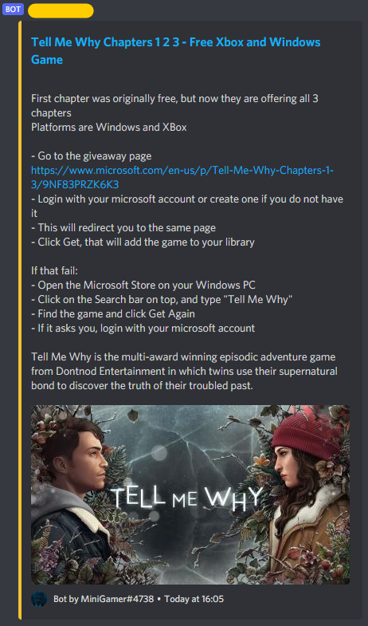

# Discord Server Bot <!-- omit in toc -->

This is a discord server bot made for personal use  
_This is not meant to be used for multiple discord servers_

This bot:

- fetches giveaways
- plays music

## Table Of Contents

- [Table Of Contents](#table-of-contents)
- [Usage](#usage)
  - [Continous Run](#continous-run)
  - [Setup environment variables](#setup-environment-variables)
  - [Tests](#tests)
- [Commands](#commands)
- [Giveaways](#giveaways)
  - [Fetching](#fetching)
  - [Conversion](#conversion)
  - [Conversion Result](#conversion-result)
  - [Posting Giveaways](#posting-giveaways)
- [Memes](#memes)
- [Music](#music)
- [Useful Links](#useful-links)

## Usage

[Table Of Contents](#table-of-contents)

You can follow a [guide](https://discordjs.guide/#before-you-begin) to get started

Setup your bot application in the [Discord developer portal](https://discord.com/developers/applications)

Install yarn -- [guide](https://classic.yarnpkg.com/lang/en/docs/install/)

```bash
npm install --global yarn
```

Run the script with

```bash
yarn start
```

### Continous Run

If you want to have it running continously I reccomend [pm2](https://github.com/Unitech/pm2)

```bash
npm install --global pm2
```

Install [pm2-logrotate](https://github.com/keymetrics/pm2-logrotate) to keep the log files limited size

```bash
pm2 install pm2-logrotate
```

This project has setup [pm2 config file](./pm2.config.js) so you can easily get started using the following command
> NB: this only works on linux systems

```bash
pm2 start pm2.config.cjs
```

### Setup environment variables

For environment variables I use [dotenv](https://github.com/motdotla/dotenv)

example [.env](./.env.example)

```ini
DISCORD_CLIENT_ID=XXX
DISCORD_CLIENT_TOKEN="XXX"
DISCORD_CLIENT_PUBKEY="XXX"

DISCORD_GUILD_ID=XXX
TEST_CHANNEL_ID=XXX
GIVEAWAYS_CHANNEL_ID=XXX
DEV=FALSE
```

The following environment variables are required to run the application:

- `DISCORD_CLIENT_ID`: The client ID of your Discord bot.
- `DISCORD_CLIENT_TOKEN`: The token of your Discord bot.
- `DISCORD_CLIENT_PUBKEY`: The public key of your Discord bot.

- `DISCORD_GUILD_ID`: The ID of the Discord server (guild) that the bot will operate in.
- `TEST_CHANNEL_ID`: The ID of the channel in the Discord server used for testing.
- `GIVEAWAYS_CHANNEL_ID`: The ID of the channel in the Discord server where giveaways will be held.

- `DEV`: Set to `TRUE` if running the bot in a development environment, otherwise set to `FALSE`.
  - Can be set via command line.

Make sure to replace the placeholder values (`XXX`) with your actual values before running the application.

### Tests

> TODO: Fix problems that have occured since switching to typescript and upgrading packages

For testing I use [Jest](https://jestjs.io/) testing framework  
Tests can be run with `yarn test`

## Commands

Commands are made using [slash-create](https://slash-create.js.org/#/) -- makes it easy to handle and create discord slash commands

## Giveaways

[Giveaway Commands](./src/commands/giveaways/)

### Fetching

This bot mainly tries to get giveaways from <https://grabfreegames.com/>  
Should that fail it will then try to get them from
[GrabFreeGames steam group page](https://steamcommunity.com/groups/GrabFreeGames/announcements/listing)

### Conversion

Fetched html will be turned into a usable format using [Cheerio](https://cheerio.js.org/) and
[Turndown](https://github.com/domchristie/turndown) - used to convert HTML into MD.  
Resulting string will be turned into a MessageEmbed.

### Conversion Result

- URL used during fetch will become the title url to link the source
- Border colour of MessageEmbed is the same colour that the bot has in the Server's member list
- Image is only displayed if the source has it



### Posting Giveaways

When the bot runs giveaways will be posted into the giveaway channel.  
The bot will check if a MessageEmbed with the same title can already be found in the channel.
This check can be disabled but is on by default - used when sending messages into a channel in bulk.

Before the previous check, giveaways that have been sent will be filtered out using a **json** file.  
This is used since the previous check only compares against last 100 messages sent in the channel.  
_This filtering won't happen if giveaway channel was changed_

This file will be generated in the [data](./data) folder

## Memes

[Meme Commands](./src/commands/memes/)

> TODO: Plan is to have this bot send memes taken from reddit

## Music

[Music Commands](./src/commands/music/)

For music bot functionality I use [discord-player](https://discord-player.js.org/) which handles the nitty gritty.  

## Useful Links

[Regex101](https://regex101.com/) -- extremely helpful in the making of regular expressions.

[Discord.js guide](https://discordjs.guide/) -- starting the project from the ground up

[Discord.js documentation](https://discord.js.org/#/docs/discord.js/main/general/welcome)

[PM2 documentation](https://pm2.keymetrics.io/docs/usage/pm2-doc-single-page/)

[slash-create documentation](https://slash-create.js.org/#/docs/main/latest/general/welcome)

[Go to the table of contents](#table-of-contents)
